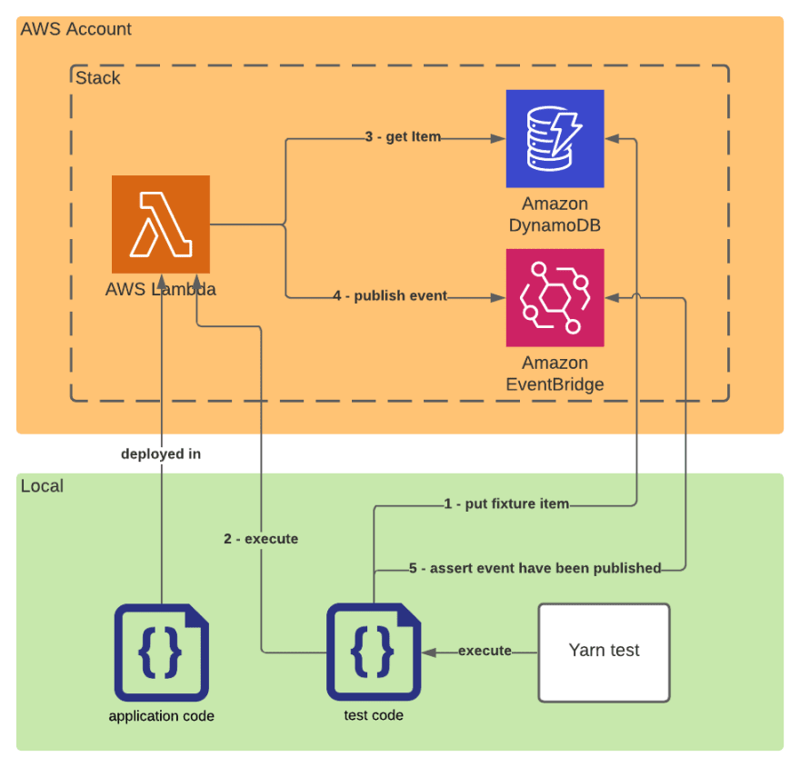

Integration tests are part of the well known [test pyramid](https://martinfowler.com/articles/practical-test-pyramid.html). They test the interaction between services. On average Serverless applications are composed of more services than more traditional architectures. It's, therefore, more important to implement integration tests in a Serverless application.

This article is a step-by-step guide to adding integration tests to your serverless project.

All examples are written in [Typescript](https://www.typescriptlang.org/), using [Jest](https://jestjs.io/) testing engine, on an [AWS](https://aws.amazon.com/) serverless stack. They can easily be used in javascript projects. Core concepts also apply to other languages, test frameworks, and cloud providers.

## TL;DR

This article uses a simple serverless application as example.


The application is composed of one lambda which:

1. Gets an item from [DynamoDB](https://aws.amazon.com/dynamodb/).
2. Then publishes an event in [EventBridge](https://aws.amazon.com/eventbridge/).



The corresponding integration test asserting the lambda behaves as expected will:

1. Push fixture data in the DynamoDB
2. Execute the application code in integration with the real DynamoDB and EventBridge services
3. Assert the event have been published

```ts
import { DynamoDBClient } from '@aws-sdk/client-dynamodb';
import { InvokeCommand, LambdaClient } from '@aws-sdk/client-lambda';
import { DeleteCommand, DynamoDBDocumentClient, PutCommand } from '@aws-sdk/lib-dynamodb';
import { EventBridge } from 'sls-test-tools';

const ddbDocClient = DynamoDBDocumentClient.from(new DynamoDBClient({}));
const lambdaClient = new LambdaClient({});

it('gets the item and publishes it as an event', async () => {
  // Arrange
  await ddbDocClient.send(
    new PutCommand({
      TableName: process.env.TABLE_NAME,
      Item: {
        PK: 'MyPartitionKey',
        SK: 'MySortKey',
        payload: 'MyPayload',
      },
    }),
  );
  const eventBridge = await EventBridge.build(process.env.BUS_NAME);
  // Act
  const { FunctionError } = await lambdaClient.send(new InvokeCommand({ FunctionName: 'my-lambda' }));
  expect(FunctionError).toBeUndefined();
  // Assert
  const events = eventBridge.getEvents();
  expect(events).toHaveEventWithSource('my-lambda');
  // Clean
  await ddbDocClient.send(
    new DeleteCommand({
      TableName: process.env.TABLE_NAME,
      Key: {
        PK: 'MyPartitionKey',
        SK: 'MySortKey',
      },
    }),
  );
  await eventBridge.destroy();
});
```

## Use a specific test config

The first thing to do is to configure your test framework.

It's easier to use the same test framework for your unit and integrations tests. But unit and integration tests must run separately and with different configurations.

Add a `jest.integration.config.ts` at the root of your project next to your `jest.config.ts`. It can extend the `jest.config.ts` but but it overrides some parameters.

### Don't use mocks

Integration tests interact with real services. If you have mocked some of them for unit test purposes, they should be ignored.

```ts
// jest.integration.config.ts
export default {
  ...commonJestConfig,
  modulePathIgnorePatterns: ['_mock_'],
};
```

### Use specific files

Unit and integration tests must be executed separately, the easiest way to do it is to use different files for the integrations test: `myLambda.integration-test.ts` or `myLambda.integration-spec.ts` or `__integrationTests__/myLambda.ts`.

The integration configuration must only execute those files.

```ts
// jest.integration.config.ts
export default {
  ...commonJestConfig,
  testRegex: '(/__integrationTests__/.*|(\\.|/)(integration-test|integration-spec))\\.(jsx?|js?|tsx?|ts?)$',
};
```

### Increase the timeout

Integration tests require on average more time to run than unit tests because they often wait for the responses of external services.

```ts
// jest.integration.config.ts
export default {
  ...commonJestConfig,
  testTimeout: 10000, // 10s
};
```

### Add a setup file

A setup file contains some code that runs before test initialization. It will be useful in the next part to load environment variables.

```ts
// jest.integration.config.ts
export default {
  ...commonJestConfig,
  setupFiles: ['<rootDir>/test/setup_integration.ts'],
};
```

### Run sequentially

Integration tests create side effects. It's recommended to run them sequentially to avoid mixing the side effects.

```bash
yarn jest -c jest.integration.config.ts --runInBand
```

_Note: `runInBand` can only be specified as a CLI param, it cannot be configured using ` jest.integration.config.ts`_

## Interact with a real AWS Stack

As explained at the beginning of this article, integration tests aim at testing your application’s code in integration with your ecosystem of services. To achieve this, your tests should run against an actual AWS account and interact with AWS services within. Running your test will therefore require the use of your existing dev stack or a specific test stack.


### Nice to have: Set up a test stack

If you want to fully control the behavior of the stack used for the integration tests I recommend you set up a dedicated stack per developer. The data on this stack will only be test fixtures and can be wiped out between tests.

Serverless applications generally have on-demand pricing, therefore if you use infrastructure as code you can easily create an exact copy of your stack. The resulting cost is the same running all tests on one stack or splitting the tests in separate stacks per developer.


The main drawback of this implementation is that you need to deploy two stacks after each change.

### Use AWS SDK

The AWS SDK makes it easy to interact with AWS services from your local computer.

```ts
import { DynamoDBClient } from '@aws-sdk/client-dynamodb';
import { DynamoDBDocumentClient, PutCommand } from '@aws-sdk/lib-dynamodb';

const ddbDocClient = DynamoDBDocumentClient.from(new DynamoDBClient({}));

it('myTest', async () => {
  await ddbDocClient.send(
    new PutCommand({
      TableName: 'MyTable',
      Item: {
        PK: 'MyPartitionKey',
        SK: 'MySortKey',
      },
    }),
  );
});
```

If you execute this test locally, it would put an item in the real DynamoDB table named `MyTable` of the default region of your default AWS account. It would act nearly the same as if the PutCommand were executed in a lambda in the default region of your default AWS account.

Thus, you can use the same code that you use in your lambda to push test fixtures or to expect a side effect happened. You can also use the same utils you generally use in your lambda to interact with services, such as an ORM, [DynamDBToolBox](https://github.com/jeremydaly/dynamodb-toolbox) or [TypeBridge](https://github.com/fredericbarthelet/typebridge).

### Load environment variables

For most AWS services you need at least one identifier to interact with a service instance. In the latest example, it's the `tableName` of the DynamoDB table. The best way to pass them to your application code is to use environment variables.


At runtime, the environment variables are stored by AWS Lambda and injected into the executed code.


To interact with the services in integrations tests the same way it's done in lambda, the environment variables must be loaded in the test process.

Let's use the test setup file to inject the environment variables in each integration test suite.

```ts
// test/setup_integration.ts

process.env.TABLE_NAME = 'MyTable';
process.env.BUS_NAME = 'MyBus';
```

To easily manage your environment variables and avoid committing them, I recommend you to use [dotenv](https://github.com/motdotla/dotenv#readme) to load your variables.

```sh
# .env.test
TABLE_NAME=MyTable
BUS_NAME=MyBus
```

```ts
// test/setup_integration.ts
import { config as loadEnv } from 'dotenv';

loadEnv('.env.test');
```

### Allow access to AWS services

To interact with an AWS service you need to be authenticated and authorized.

At runtime, [the AWS SDK resolves its identity using multiple methods](https://docs.aws.amazon.com/sdk-for-javascript/v2/developer-guide/setting-credentials-node.html).

When it's executed in lambda, it resolves the role assumed by the lambda and uses it to interact with the services.

When it's executed locally you can choose how it resolves the credentials to use. I recommend using [AWS profiles](https://docs.aws.amazon.com/cli/latest/userguide/cli-configure-profiles.html).

1. Create an AWS programmatic user in the account of your test stack. _Note: if you already have a dev profile with enough rights, you can use it and skip steps 1. to 3._
2. Attach him at least the union of the policies of you lambdas (to be able to run every lambda locally). If you use your own dev account you can use admin rights to be able to interact with all services freely.
3. Configure an AWS profile
   ```sh
   aws configure --profile my-test-profile
   ```
4. Add an `AWS_PROFILE` environment variable which must be loaded in the test process.
   ```sh
   # .env.test
   AWS_PROFILE=my-test-profile
   # ... the other environment variables
   ```

## Write your first test

You are now ready to write the first integration test of the sample application.


The application code is the following:

```ts
// handler.ts
import { DynamoDBClient } from '@aws-sdk/client-dynamodb';
import { EventBridgeClient, PutEventsCommand } from '@aws-sdk/client-eventbridge';
import { DynamoDBDocumentClient, GetCommand } from '@aws-sdk/lib-dynamodb';

const ddbDocClient = DynamoDBDocumentClient.from(new DynamoDBClient({}));
const eventBridgeClient = new EventBridgeClient({});

export const handler = async (): Promise<void> => {
  const { Item } = await ddbDocClient.send(
    new GetCommand({
      TableName: process.env.TABLE_NAME,
      Key: {
        PK: 'MyPartitionKey',
        SK: 'MySortKey',
      },
    }),
  );

  if (Item === undefined) {
    throw new Error('The item must be defined');
  }

  await eventBridgeClient.send(
    new PutEventsCommand({
      Entries: [
        {
          EventBusName: process.env.BUS_NAME,
          Source: 'my-lambda',
          DetailType: 'ItemFound',
          Detail: JSON.stringify(Item),
        },
      ],
    }),
  );
};
```

### 1. Arrange: Setup and load fixtures in a real stack

To be executed without error, this application code needs a specific item in the DynamoDB table. The fixture must be loaded before executing it.

```ts
// handler.integration-test.ts
import { DynamoDBClient } from '@aws-sdk/client-dynamodb';
import { DynamoDBDocumentClient, PutCommand } from '@aws-sdk/lib-dynamodb';

const ddbDocClient = DynamoDBDocumentClient.from(new DynamoDBClient({}));

it('gets the item and publishes it as an event', async () => {
  // Arrange
  await ddbDocClient.send(
    new PutCommand({
      TableName: process.env.TABLE_NAME,
      Item: {
        PK: 'MyPartitionKey',
        SK: 'MySortKey',
        payload: 'MyPayload',
      },
    }),
  );
});
```

### 2. Act: Import the local code or execute a lambda

You can now execute your application code. You can either run the application code locally or in a lambda.

#### 2.a Execute application code in Lambda


```ts
// handler.integration-test.ts
import { InvokeCommand, LambdaClient } from '@aws-sdk/client-lambda';

const lambdaClient = new LambdaClient({});

it('gets the item and publishes it as an event', async () => {
  // Arrange [...]
  // Act
  const { FunctionError } = await lambdaClient.send(new InvokeCommand({ FunctionName: 'my-lambda' }));
  expect(FunctionError).toBeUndefined();
});
```

The application code is executed as it would be in production. It's, therefore, the most reliable. However, you need to deploy the function each time you modify the code.

#### 2.b Execute application code locally


```ts
// handler.integration-test.ts
import { handler } from './handler';

it('gets the item and publishes it as an event', async () => {
  // Arrange [...]
  // Act
  await handler();
});
```

The application code is executed locally. The feedback loop is shorter. You can use `--watch` mode to execute the test each time you change the code.

Use the same node version locally to be as close as possible to the lambda environment.

But there are some errors you can't catch locally:

- The unset environment variable errors because you have all environment variables in your `.env.test`.
- Your local profile is not the same as the lambda role. You could have the right to publish in event bridge locally and forget to pass it to the lambda role.

#### 2.c Use both

I recommend you execute your application code locally while you are developing the test or the application code to benefit from the short feedback loop.

Once you're sure your code act correctly, deploy it and change the test to execute the deployed lambda to catch environment and rights issues.

### 3. Assert: Expect real change on the stack

You can now check that the event has been published.

With most services, you can also use the AWS SDK to interact with it and notice its state has changed.

With Eventbridge it's a little more complicated because you need to intercept the events. Hopefully, you can use [sls-test-tools](https://github.com/aleios-cloud/sls-test-tools) to easily intercept EventBridge events and assert the event has been published.

```ts
// handler.integration-test.ts
import { EventBridge } from 'sls-test-tools';

it('gets the item and publishes it as an event', async () => {
  // Arrange [...]
  const eventBridge = await EventBridge.build(process.env.BUS_NAME);
  // Act [...]
  // Assert
  const events = eventBridge.getEvents();
  expect(events).toHaveEventWithSource('my-lambda');
});
```

### 4. Clean: Remove the trace of the side effects before the next test

The last thing to do is to clean the test stack to avoid tests interfering.

```ts
// handler.integration-test.ts
import { DynamoDBClient } from '@aws-sdk/client-dynamodb';
import { DynamoDBDocumentClient, PutCommand } from '@aws-sdk/lib-dynamodb';
import { EventBridge } from 'sls-test-tools';

const ddbDocClient = DynamoDBDocumentClient.from(new DynamoDBClient({}));

it('gets the item and publishes it as an event', async () => {
  // Arrange [...]
  const eventBridge = await EventBridge.build(process.env.BUS_NAME);
  // Act [...]
  // Assert [...]
  // Clean
  await ddbDocClient.send(
    new DeleteCommand({
      TableName: process.env.TABLE_NAME,
      Key: {
        PK: 'MyPartitionKey',
        SK: 'MySortKey',
      },
    }),
  );
  await eventBridge.destroy();
});
```

### The complete test file

```ts
import { DynamoDBClient } from '@aws-sdk/client-dynamodb';
import { InvokeCommand, LambdaClient } from '@aws-sdk/client-lambda';
import { DeleteCommand, DynamoDBDocumentClient, PutCommand } from '@aws-sdk/lib-dynamodb';
import { EventBridge } from 'sls-test-tools';

const ddbDocClient = DynamoDBDocumentClient.from(new DynamoDBClient({}));
const lambdaClient = new LambdaClient({});

it('gets the item and publishes it as an event', async () => {
  // Arrange
  await ddbDocClient.send(
    new PutCommand({
      TableName: process.env.TABLE_NAME,
      Item: {
        PK: 'MyPartitionKey',
        SK: 'MySortKey',
        payload: 'MyPayload',
      },
    }),
  );
  const eventBridge = await EventBridge.build(process.env.BUS_NAME);
  // Act
  const { FunctionError } = await lambdaClient.send(new InvokeCommand({ FunctionName: 'my-lambda' }));
  expect(FunctionError).toBeUndefined();
  // Assert
  const events = eventBridge.getEvents();
  expect(events).toHaveEventWithSource('my-lambda');
  // Clean
  await ddbDocClient.send(
    new DeleteCommand({
      TableName: process.env.TABLE_NAME,
      Key: {
        PK: 'MyPartitionKey',
        SK: 'MySortKey',
      },
    }),
  );
  await eventBridge.destroy();
});
```

## Conclusion and next step

You can now configure and write integration tests. You can run them locally in interaction with a test stack.

The next step is to run them in CI. It's a tricky subject that I detailed in a second article.


