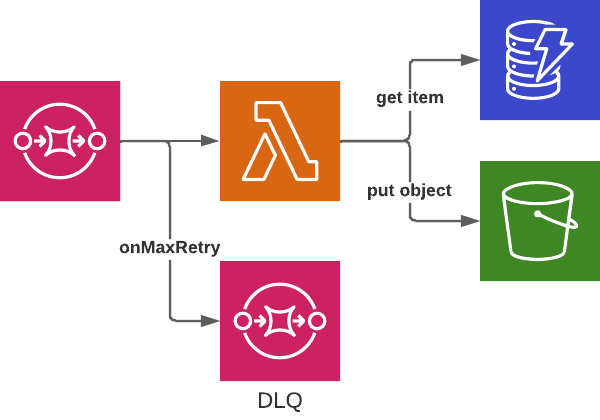
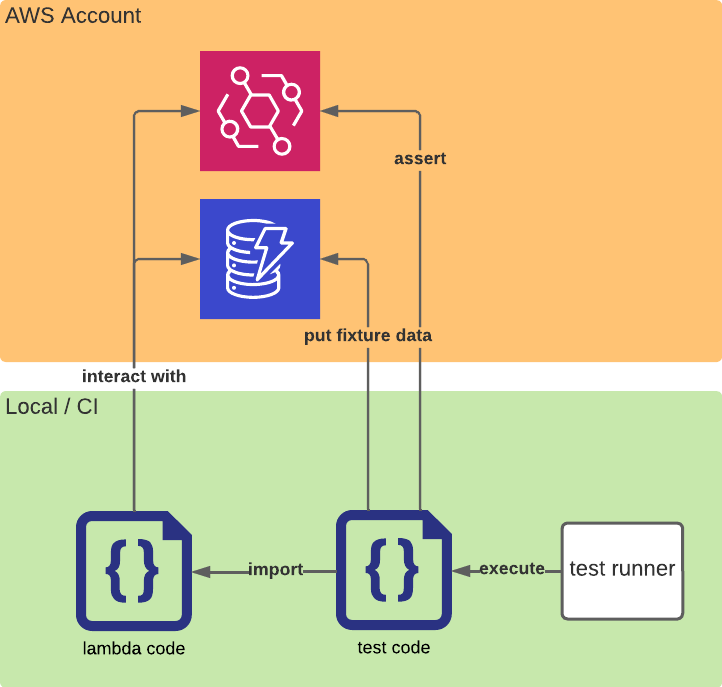
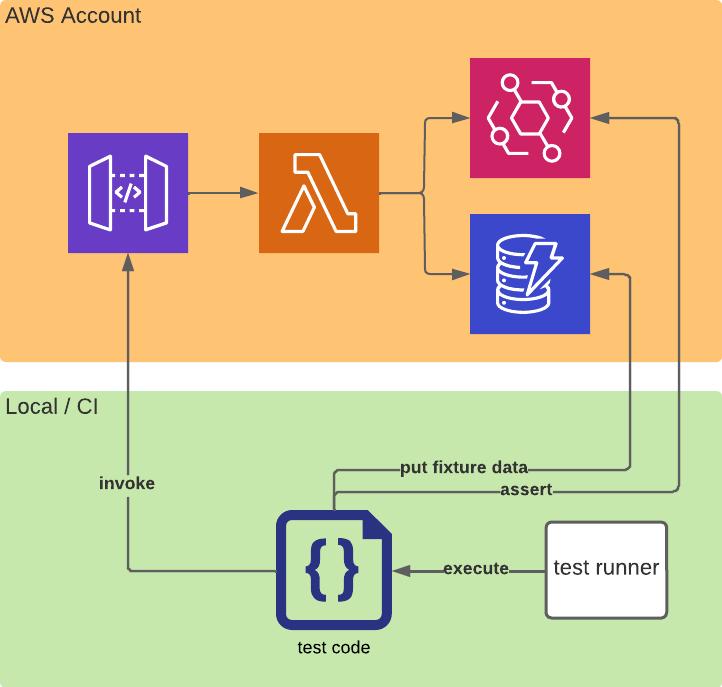
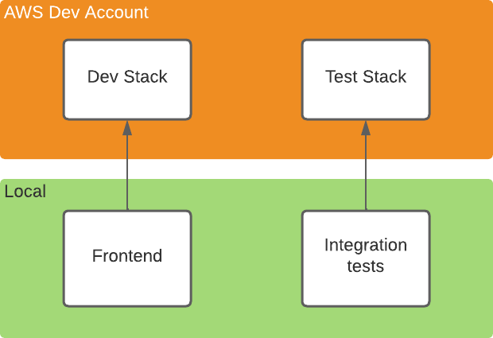
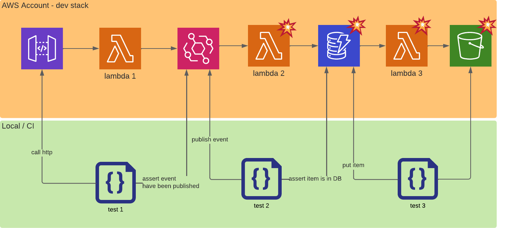
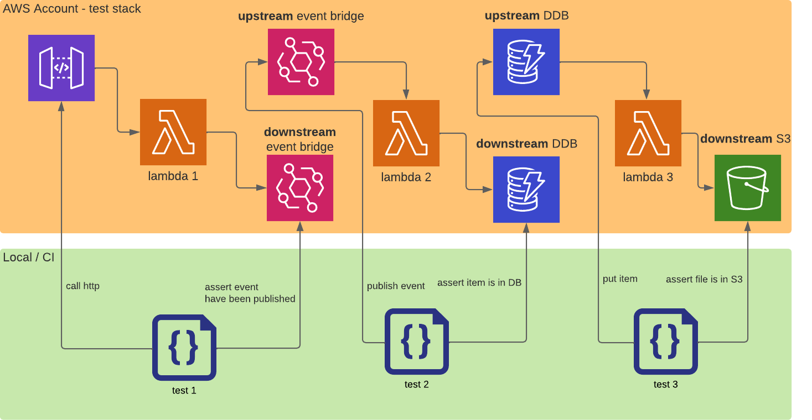

Serverless applications are composed of many services interacting with one another. A lot more than traditional web applications.

Service configurations replace some application code. Parts of the application are black box managed by a cloud provider. Those configuration and their effects can only be tested with integration tests.

That’s why it is crucial for all **serverless applications to have relevant integration test coverage**.

Without integration tests, you expose your application to hard-to-fix bugs because they don’t come from your application code but from a misconfiguration.

## 🤔 Intent

There is no unique perfect way to implement integration tests. It depends on the context such as the application or the team.

But after 2 years of experimentation on serverless integration tests on several projects, I have seen some patterns emerge. I summed them up in **5 control points**.

I will illustrate each one of them with OK ✅ and KO ❌ real-life examples. Those examples are meant to help you **forge your own opinion** on the subject and help you implement your own integration tests according to your context.

## 🎯 The 5 controls points

1. **Write one test case per integration ⛓️**
2. **Test deployed resources 🚀**
3. **Keep the feedback loop below 1 min ♻️**
4. **Don’t create side effects 💥**
5. **Run integration tests in CI before merge** 🚦

Let's detail them.

## 1. Write one test case per integration ⛓️

To ensure good coverage without writing too many tests. Determine what services are communicating and test every interaction once.

### ✍️ Real-life example

Let’s take an async lambda triggered by event-bridge which gets an item in dynamoDb and then put a generated file in a S3 bucket.



There are 5 configurations to tests:

- `invoke`: SQS ➡️ Lambda
- `getItem`: Lambda ➡️ DynamoDB
- `putObject`: Lambda ➡️ S3
- `retry`: SQS ➡️ Lambda
- `onMaxRetry`: SQS ➡️ DLQ

| ❌ **Bad** |
| ---------- |

#### Forget to test that a wrong message ends up in the DLQ

⇒ ❌ The `retry` and `onMaxRetry` configurations are not tested.

#### Test that different files are generated if you put different fixtures in the table

⇒ The first test tested `invoke` & `getItem` & `putObject`

⇒ ❌ Subsequent tests **add no value** because they will test again the same configurations and an integration test shouldn't test all business logic.

⇒ ❌ Moreover it **slows down your test phase** because integration tests are slower than unit ones. If you write 10 integration test cases per lambda each time 2 are required, your whole testing suite will be 5 times slower than it could be.

| 💡 You should use unit tests to test the business logic |
| ------------------------------------------------------- |

---

| ✅ **Good** |
| ----------- |

#### Two test cases:

- A first test with a fixture item in the table, a real event that triggers the lambda, and an assertion on the object creation in S3

  ⇒ ✅ Test `invoke` & `getItem` & `putObject`

- A malformed event that triggers the lambda and ends up in the DLQ after 3 retries

  ⇒ ✅ Test `retry` & `onMaxRetry`

---

## 2. Test deployed resources 🚀

In order to test the effect of a configuration on a service, it must be deployed in real conditions.

### ✍️ Real-life example

| ❌ **Bad** |
| ---------- |

#### Mock / emulate a service locally


⇒ ❌ Open source mock can’t perfectly implement the behavior of a cloud provider service and keep up with new features.

#### Import and execute a lambda handler locally in the test



⇒ ❌ the upstream event is not tested.

⇒ ❌ the lambda configuration is not tested.

---

| ✅ **Good** |
| ----------- |

#### Deploy your resources in a real stack and let your test code interact with the interfaces



⇒ ✅ The configuration of the upstream service is tested.

⇒ ✅ The configuration of the lambda is tested.

⇒ ✅ The code of the lambda is tested.

⇒ ✅ The configurations of the downstream services are tested.

| 💡 For lambda interacting with external services, use real services if possible. If they are not stable or too expensive, consider replacing the url of the external service with the url of a mock |
| --- |

---

## 3. Keep the feedback loop below 1 min ♻️

Tests must be easy to write and debug if you want your team to write and maintain them.

A new change must be deployed as quickly as possible to be tested without delay.

A test must be quick to run without pain.

### ✍️ Real-life example

| ❌ **Bad** |
| ---------- |

#### Use separate stacks to e2e and integration testing



⇒ ❌ Keeping two stacks synced is a pain for developers.

| 💡 This doesn’t mean you should use the same resources for your integration tests and your e2e usage. But they should be in the same stack to synchronize the deployment. |
| --- |

#### Trigger a full deployment between two development iterations

For example, use `sls deploy` each time you change your code.

⇒ ❌ Those deployments are too long to iterate quickly.

---

| ✅ **Good** |
| ----------- |

#### Use real-time deployment tools

Serverless frameworks provide tools to keep your dev stack synced with your code in real-time:

- ✅ `sst start` for SST
- ✅ `cdk watch` for CDK
- ⚠️ `sls deploy -f myFunctionName` for serverless framework

| ℹ️ sls deploy -f requires you to manually trigger the deployment between each change |
| ------------------------------------------------------------------------------------ |

---

## 4. Don’t create side effects 💥

To run your tests in parallel and without breaking your development environment, you need to isolate the tests from the rest of the app.

### ✍️ Real-life example

| ❌ **Bad - Code Level** |
| ----------------------- |

#### Require an empty state to run

```tsx
// ❌ Requires running the tests synchronously
beforeEach(async () => truncateAllData());

it('creates a user', async () => {
  await axios.post(`${URL}/users`, user);

  const users = await User.findAll();
  // ❌ Breaks if another user is in the database
  expect(users).toEqual([user]);
});
```

---

| ✅ **Good - Code Level** |
| ------------------------ |

#### Create isolated data

```tsx
const userId = uuidV4(); // ✅ No collision const user = { userId, /_ ... _/ };

afterEach(async () => deleteUser(userId)); // ✅ Delete only test data

it('creates a user', async () => {
  await axios.post(`${URL}/users`, user);

  const users = await User.findAll();
  // ✅ Another user from another test or e2e data can be in the list
  // without impacting the test result
  expect(users).toContainsEqual(user);
});
```

---

| ❌ **Bad - Infrastructure level** |
| --------------------------------- |

#### Let async test events propagate and break downstream components in event driven architectures

| ℹ️ This only concerns event driven architectures |
| ------------------------------------------------ |



⇒ Test 1 will create events that trigger the lambda 2 & 3 in an uncontrolled context.

⇒ ❌ If want to control the context of lambda 2 & 3 while testing lambda 1, the complexity explodes with the size of the async flow 🤯. It becomes an e2e test, that's not what we want here.

⇒ ❌ If you let the events propagate, you will end with lots of “normal” errors that will prevent you to detect real errors

 ⇒ ❌ If the async flow can affect upstream data, race conditions will appear in the tests

---

| ✅ **Good - Infrastructure level** |
| ---------------------------------- |

#### Breaks the async flows in event driven architectures to isolate tests

| ℹ️ This only concerns event driven architectures |
| ------------------------------------------------ |



⇒ Duplicate instances of event services and plug the lambda into the rights services thanks to the environment variables.

⇒ ✅ The side effects created by a lambda are not propagated to the other lambdas.

| ⚠️ This can be a little scary but the other alternatives are: letting the event propagate (❌ cf above) or modifying production code to filter out tests events |
| --- |

| 💡 I’m working on the automation of the duplication and the wiring of environment variables to abstract this away from the developer. Stay tuned 🔊 |
| --- |

---

## 5. Run integration tests in CI before merge 🚦

Integration tests break often. And it’s good, they catch for you all sorts of mistakes. You need to run them as soon as possible in your automated tests suite.

Even if it requires more configuration at first, take the time to make them run in your CI for every pull request/merge request.

You also need to think about keeping your integration test job fast enough to be awaited without pain.

### ✍️ Real-life example

| ❌ **Bad** |
| ---------- |

#### Run automated integration tests in preprod/staging

1. Write a new service integration & the corresponding test on your developer environment
2. Push your code & open a pull request/merge request
   1. run units tests in CI
   2. review code
3. After the merge on the staging branch, deploy the code on the staging environment
4. Run all integration tests on the staging environment

⇒ Developers will not run every test on every change in their developer environment, sometimes unexpected side effects will break unexpected tests.

⇒ ❌ In that case the tests will fail in the staging branch which will impact all other developers who need this environment as stable as possible.

⇒ ❌ The fix must be done quickly & is expensive because it requires starting the development flow from scratch: create a new branch, make the fix, test it properly, open a new pull request, pass the CI, pass the code review and then merge.

---

| ✅ **Good** |
| ----------- |

#### Deploy and run integration test on every pull request/merge request on a dedicated environment

| ℹ️ Serverless heavily relies on infrastructure as code and pay-as-you-use resources. Therefore it’s easy and cheap to deploy multiple environments |
| --- |

1. Write a new service integration & the corresponding test on your developer environment
2. Push your code & open a pull request/merge request
   1. run units tests in CI
   2. deploy a dedicated test environment & run all integration tests on it
   3. review code
3. After the merge on the staging branch, deploy the code on the staging environment

⇒ ✅ If a test fails, you only need to push a fix in the existing branch.

⇒ ✅ It checks that the infrastructure as code is working properly and you are sure that staging deployment will succeed.

| 💡 To speed up test environment deployment, you can work with a pool of test stacks and only deploy changes on them. |
| -------------------------------------------------------------------------------------------------------------------- |

⇒ More details about how to implement it:





## Conclusion

I hope those 5 control points will help you to write better tests and to have a better development experience.

Keep them in mind and try to apply them as soon as possible in a project life cycle, tests are a pain to implement/refactor afterward. The bad examples mostly come from projects I've worked on. I know how painful it is to have to refactor tests because your team is stuck. Don't wait until it's too late 😉

Feel free to share your thoughts and questions in the comments below. I will be happy to answer them.
