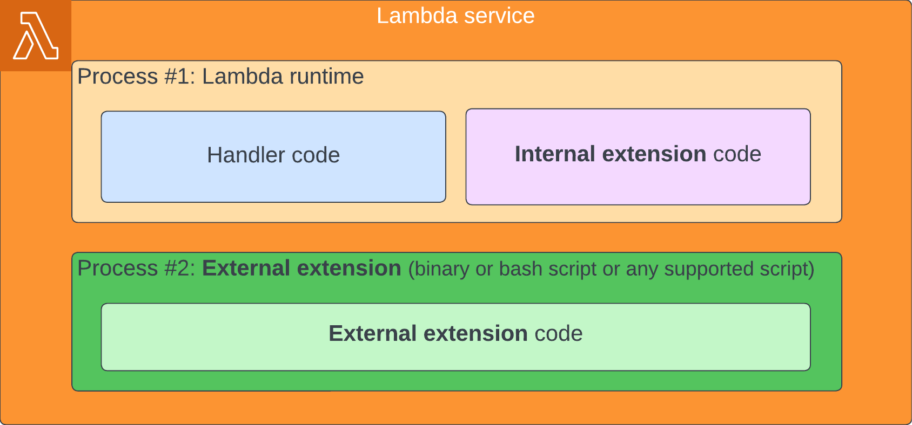
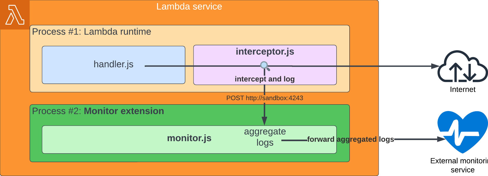
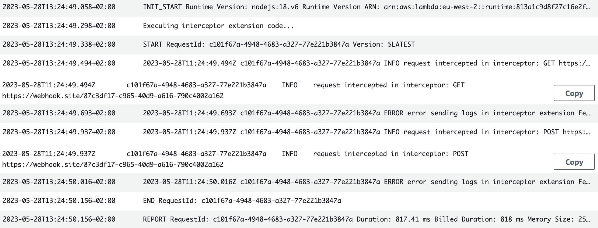
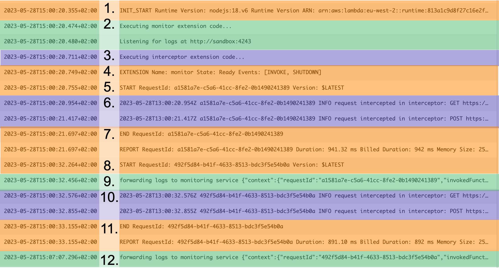

The AWS Lambda service has some killer features that you probably don't know. One of them is the ability to run additional code alongside the handler code. This feature is called [extensions](https://docs.aws.amazon.com/lambda/latest/dg/lambda-extensions.html).

This article explains how to create your own monitoring tool with internal and external extensions and how to use it to monitor your lambdas without degrading its performances. The implementation uses NodeJs Lambda deployed with AWS CDK.

## ⚡ The Lambda extension feature

Let's start by a quick recap on Lambda extension. If you are already familiar with it feel free to jump to the creation part.

### 🤔 What is an Lambda extension?

An Lambda extension is a piece of code that runs in the same execution environment as the lambda handler.

It can be:

- **internal**: it runs in the same process as the handler code.
- **external**: it runs in a separate process.



In both case it shares the memory, timeout and ephemeral storage of the execution environment with the handler.

It can interact with the Lambda service to be notified on each event received by the handler and can receive telemetry events from the Lambda service.

An **internal extension** can be used to add capabilities directly to the handler code because it runs in the same process.

For example, an internal monitoring extension can override the http library to intercept and log all http calls.

Because it runs in a separate process, an **external extension** can add capabilities to the handler without impacting its performance.

For example, an external monitoring extension can send metrics to an external monitoring service after the handler has returned its response to avoid degrading an API performance.

### 🧩 How to use a Lambda extension

A Lambda extension comes as a [**Lambda layer**](https://docs.aws.amazon.com/lambda/latest/dg/gettingstarted-concepts.html#gettingstarted-concepts-layer).

To add an **external extension**, you only need to add the layer to your lambda. The extension process will be spawn automatically.

To add an **internal extension**, you need to add the layer to your lambda but you also have to configure the runtime to execute the entrypoint of the extension alongside with the handler. This configuration is done using [runtime specific environment variable](https://docs.aws.amazon.com/lambda/latest/dg/runtimes-modify.html).

For example, for NodeJs, you need to set the `NODE_OPTIONS` environment variable to `--require /opt/my-extension.js`.

## ⚙️ How to create an extension

Let's create a monitoring extension that logs all http calls made by the lambda and send them to a external service for storage and visualisation.

We will use an internal extension to intercept all http calls and forward them to an external extension which sends a monitoring recap after each lambda invocation.



All the code following code is available on github:



### 🔍 The interceptor internal extension

The interceptor must be executed in the same process as the handler to be able to intercept all http calls.

#### 📝 The interceptor code

For simplicity, we use [msw](https://mswjs.io/) as out of the box node interceptor.

```ts
// src/layers/monitorExtension/partial-interceptor.ts

import { rest } from 'msw';
import { setupServer } from 'msw/node';

const server = setupServer(
  rest.all('*', async req => {
    const url = req.url.toString();
    const method = req.method;
    console.log(`request intercepted in interceptor: ${method} ${url}`);

    return req.passthrough();
  }),
);

server.listen({ onUnhandledRequest: 'bypass' });
```

Then we forward the logs to the external extension with a local http call.

💡We must use the **sandbox** url because it's the only one authorized in the lambda execution environment. The port is free, so I chose a random one.

```ts
// src/layers/monitorExtension/interceptor.ts

import { rest } from 'msw';
import { setupServer } from 'msw/node';
import fetch from 'node-fetch';

console.log('Executing interceptor extension code...');

const LOG_EXTENSION_SERVER_URL = 'http://sandbox:4243';
const server = setupServer(
  rest.all('*', async (req, res, ctx) => {
    const url = req.url.toString();

    // Bypass the calls made by this code to the local server to avoid infinite loop
    if (url.includes(LOG_EXTENSION_SERVER_URL)) {
      return req.passthrough();
    }

    const method = req.method;
    const headers = req.headers;
    const body = await req.text();

    console.log(`request intercepted in interceptor: ${method} ${url}`);
    fetch(LOG_EXTENSION_SERVER_URL, {
      method: 'POST',
      body: JSON.stringify({
        url,
        method,
        headers,
        body,
        date: new Date().toISOString(),
      }),
    }).catch(error => console.error('error sending logs in interceptor extension', error));

    return req.passthrough();
  }),
);

server.listen({ onUnhandledRequest: 'bypass' });
```

#### 🚀 Deploy the internal extension

First we need to make the extension code executable by the lambda. The simplest way is to use `esbuild` to bundle it in a single cjs file.

💡 That's basically what is done with the handler code under the wood by CDK when using the NodejsFunction construct. But here, we need to do it manually.

```json
{
  "scripts": {
    "build:interceptor": "./node_modules/.bin/esbuild  ./src/layers/monitorExtension/interceptor.ts --bundle --outfile='./dist/layers/monitorExtension/interceptor.js' --platform=node --main-fields=module,main"
  }
}
```

Then we need to ship the code to the lambda thanks to a lambda layer.

With CDK, we can use the `LambdaLayerVersion` construct to create a layer which will ship all the content of a directory into the `/opt` folder of the lambda.

```ts
// lib/partial-stack.ts

export class AppStack extends Stack {
  constructor(scope: Construct, id: string, props?: StackProps) {
    super(scope, id, props);

    const layer = new LayerVersion(scope, 'MonitorLayer', {
      code: Code.fromAsset('dist/layers/monitorExtension'),
    });

    const helloFunction = new NodejsFunction(this, 'Hello', {
      runtime: Runtime.NODEJS_18_X,
      handler: 'handler',
      entry: path.join(__dirname, `/../src/functions/hello/handler.ts`),
      layers: [layer],
    });
  }
}
```

Finally, we need to configure the lambda to execute the interceptor code alongside the handler code.

For that we need to use runtime specific environment variables. For NodeJs we need to set the `NODE_OPTIONS` environment variable to `--require /opt/interceptor.js`.

```ts
// lib/stack.ts

export class AppStack extends Stack {
  constructor(scope: Construct, id: string, props?: StackProps) {
    super(scope, id, props);

    const layer = new LayerVersion(scope, 'MonitorLayer', {
      code: Code.fromAsset('dist/layers/monitorExtension'),
    });

    const helloFunction = new NodejsFunction(this, 'Hello', {
      runtime: Runtime.NODEJS_18_X,
      handler: 'handler',
      entry: path.join(__dirname, `/../src/functions/hello/handler.ts`),
      layers: [layer],
      environment: {
        NODE_OPTIONS: '--require /opt/interceptor.js',
      },
    });
  }
}
```

That's it! We have created our internal extension.

#### 👀 Results

Lets deploy it on a simple lambda, that make http calls:

```ts
// src/functions/hello/handler.ts

import fetch from 'node-fetch';

export const hello = async () => {
  await fetch('https://webhook.site/87c3df17-c965-40d9-a616-790c4002a162');

  await fetch('https://webhook.site/87c3df17-c965-40d9-a616-790c4002a162', {
    method: 'POST',
    body: JSON.stringify({
      message: 'hello world',
    }),
  });

  return {
    statusCode: 200,
    headers: { 'Content-Type': 'application/json' },
    body: JSON.stringify({
      message: 'OK',
    }),
  };
};

export const handler = hello;
```

We can see those logs:



The interceptor code ran alongside the handler code and intercepted the http calls 🚀.

But we can see that it fails to forward them the the local http server. Let's create the external extension to fix that.

### 📊 The monitoring external extension

We want to aggregate the logs and send them to an external service without impacting the lambda performance. So we will use an external process, aka an external extension, to handle those logs.

#### 📝 The external extension code

First, we want our external process to be aware of whats happening in the lambda. To do so, we can use the [lambda extension API](https://docs.aws.amazon.com/lambda/latest/dg/runtimes-extensions-api.html) to:

1. register the process as an extension
2. subscribe to various lambda events or telemetry events

If you're not familiar with the lambda extension API, I recommend you to read the wonderful article [Simplifying internal AWS Lambda APIs](https://danwakeem.medium.com/simplifying-internal-aws-lambda-apis-25a26ab9070e) of Wakeem's World.

I publish a node package inspired by his article to abstract the communication with the lambda extension API.



With it, we can easily register our external extension and subscribe to all the invocation events and be notified when the lambda is about to shutdown.

```ts
// src/layers/monitorExtension/partial-monitor.ts

import { EventTypes, ExtensionAPIService } from 'lambda-extension-service';

console.log('Executing monitor extension code...');

const main = async () => {
  const extensionApiService = new ExtensionAPIService({
    extensionName: 'monitor',
  });
  await extensionApiService.register([EventTypes.Invoke, EventTypes.Shutdown]);

  while (true) {
    const event = await extensionApiService.next();
    console.log('Received event', event);
  }
};

main().catch(error => console.error(error));
```

Now we can start a http server to receive the logs from the internal extension.

```ts
// src/layers/monitorExtension/logServer.ts

import { createServer } from 'http';
import { Log } from './types';

type LogServerOptions = {
  port: number;
};
export const listenForLog = (onLogReceived: (log: Log) => void, { port }: LogServerOptions = { port: 4243 }) => {
  const server = createServer(function (request, response) {
    if (request.method == 'POST') {
      let body = '';
      request.on('data', function (data) {
        body += data;
      });
      request.on('end', function () {
        try {
          onLogReceived(JSON.parse(body));
        } catch (e) {
          console.error('failed to parse logs', e);
        }
        response.writeHead(200, {});
        response.end('OK');
      });
    } else {
      console.error('unexpected request', request.method, request.url);
      response.writeHead(404, {});
      response.end();
    }
  });

  server.listen(port, 'sandbox');
  console.info(`Listening for logs at http://sandbox:${port}`);
};
```

And then aggregate and send them to an external service on each new invocation or on shutdown.

```ts
// src/layers/monitorExtension//monitor.ts

import { EventTypes, ExtensionAPIService } from 'lambda-extension-service';
import { Log } from './types';
import { LogAggregator } from './logAggregator';
import { listenForLog } from './logServer';
import { LambdaContext } from './lambdaContext';
import { forwardLogs } from './forwardLogs';

console.log('Executing monitor extension code...');

const main = async () => {
  const logAggregator = new LogAggregator();
  const lambdaContext = new LambdaContext();
  const onLogReceived = (log: Log) => {
    logAggregator.addLog(log, lambdaContext.getRequestId());
  };
  listenForLog(onLogReceived);

  const extensionApiService = new ExtensionAPIService({
    extensionName: 'monitor',
  });
  await extensionApiService.register([EventTypes.Invoke, EventTypes.Shutdown]);

  while (true) {
    const event = await extensionApiService.next();
    const lastContext = lambdaContext.getContext();
    lambdaContext.updateContext(event);

    if (lastContext !== undefined) {
      await forwardLogs({
        context: lastContext,
        logs: logAggregator.getLogs(lastContext.requestId),
      });
    }
  }
};

main().catch(error => console.error(error));
```

#### 🚀 Deploy the external extension

First, we also need to make the extension code executable by the lambda. But this time it should be a standalone executable file.

💡 We reuse the same `esbuild` command as with the interceptor extension, but we need to add a shebang to make the file executable with the `--banner:js='#!/usr/bin/env node'` option.

```json
{
  "scripts": {
    "build:monitor": "./node_modules/.bin/esbuild  src/layers/monitorExtension/monitor/index.ts --bundle --outfile='./dist/layers/monitorExtension/monitor.js' --platform=node --main-fields=module,main --banner:js='#!/usr/bin/env node'"
  }
}
```

Then we need to ship the code to the lambda thanks to a lambda layer.

💡 By outputting the build of the monitor code in the same folder as the interceptor code (`./dist/layers/interceptorExtension`), the layer will ship both files without changing our CDK configuration.

Finally, we need to make the lambda execute the monitor process.

By default, the lambda service will try to execute all files in the `/opt/extensions` folder.

🤔 Theoretically, we could just add the monitor code in `./dist/layers/monitorExtension/extensions` to ship the executable script to `/opt/extensions/monitor.js` and let the lambda start it automatically. But I had some trouble with this approach, and found that all example use a proxy bash script to execute the node extension.

So let's add a bash script into `./dist/layers/monitorExtension/extensions` to start the monitor code.

```bash
# dist/layers/monitorExtension/extensions/monitor

#!/bin/bash
set -euo pipefail

OWN_FILENAME="$(basename $0)"
LAMBDA_EXTENSION_NAME="$OWN_FILENAME" # (external) extension name has to match the filename
NODE_OPTIONS="" # Needed to reset NODE_OPTIONS set by Lambda runtime. Otherwise, the internal interceptor extension will be loaded in the external process too.

exec "/opt/${LAMBDA_EXTENSION_NAME}.js"
```

This script will be shipped to `/opt/extensions/monitor` and will be executed automatically by the lambda service.

💡Note that the environment variables of the lambda are shared between processes. So we need to reset `NODE_OPTIONS` to avoid the monitor process to load the interceptor code and cause weird logs.

That's it! We finished our monitoring extension.

#### 👀 Results

Let's deploy it again on our previous lambda. Here are the final logs:



1. 🟠 The lambda service inits the lambda execution environment
2. 🟢 The monitoring external extension initialization
3. 🟣 The interceptor internal extension initialization
4. 🟠 The lambda service acknowledge the initialization of the monitoring extension
5. 🟠 The lambda service starts the first event handling
6. 🟣 The interceptor internal extension intercept the two http calls
7. 🟠 The lambda service ends the first event handling
8. 🟠 The lambda service starts the second event handling
9. 🟢 The monitoring external extension sends the logs of the first event to the external monitoring service
10. 🟣 The interceptor internal extension intercept the two http calls
11. 🟠 The lambda service ends the first event handling
12. 🟢 At lambda shutdown, the monitoring external extension sends the logs of the second event to the external monitoring service

Test it on your own AWS account using the dedicated repository:



## Conclusion

You now know how to create internal and external extensions for lambda. It's a powerful way to implement and share support tools for your lambdas without impacting their performances and without directly modifying the handler code written by other developers.

Feel free to share your thoughts and questions in the comments below. I will be happy to answer them.
