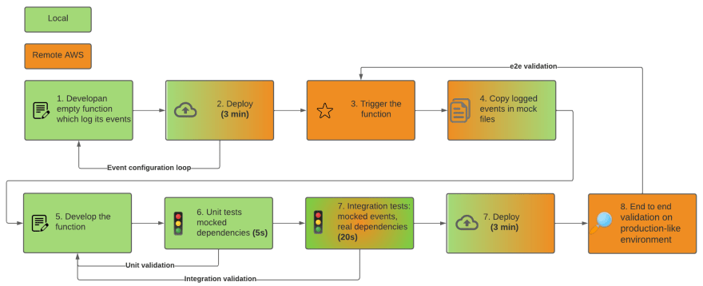
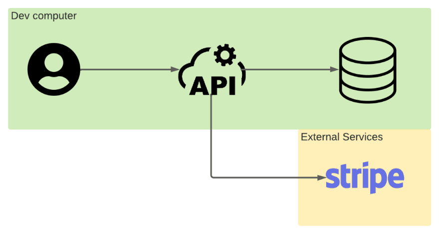
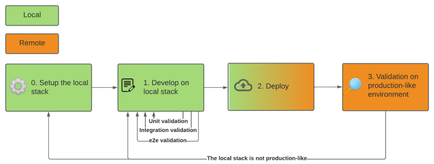
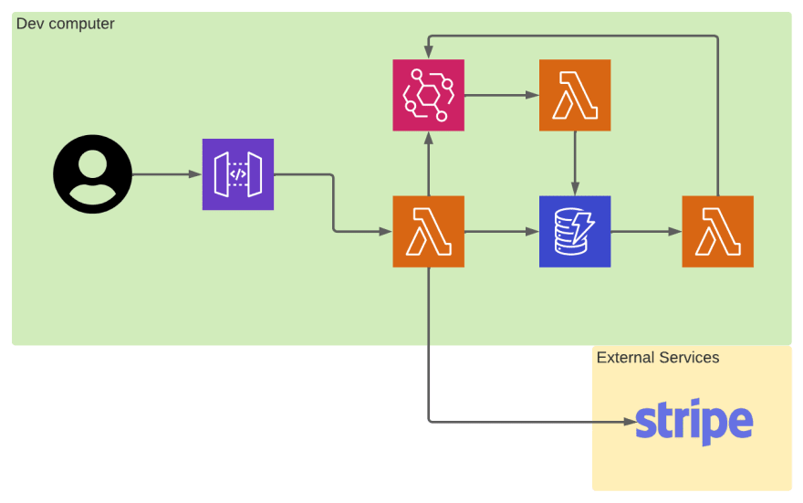
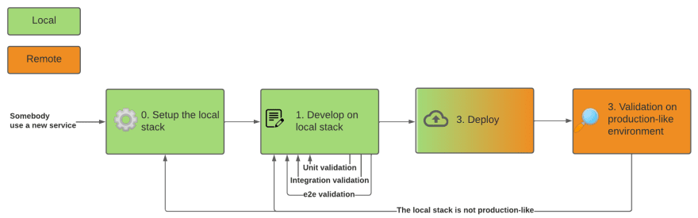
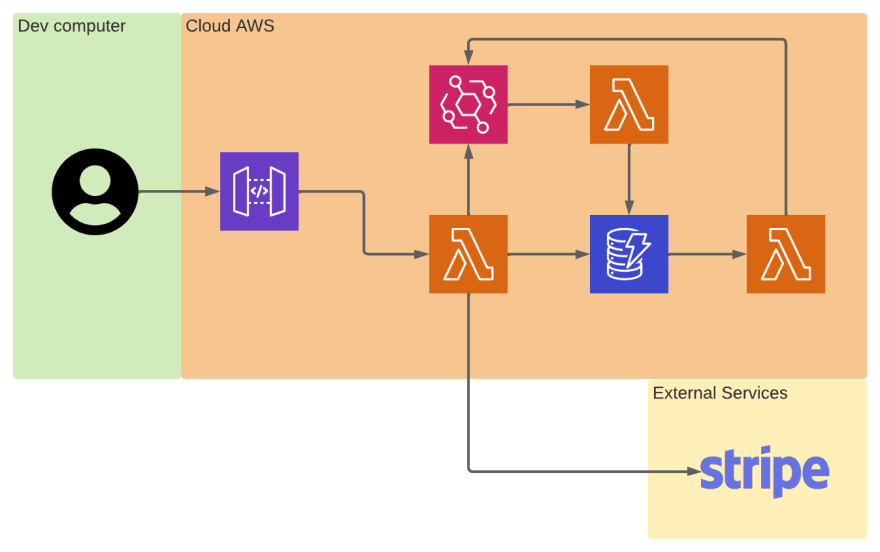
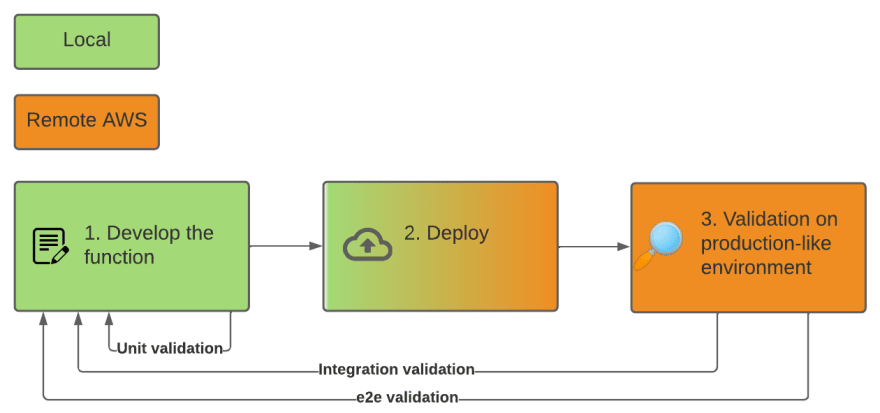

We, developers like to know the soonest when something is wrong with our code to fix it before it becomes officially a bug. That's why we use lots of tools to run our code as soon as possible in the real world. A replica of the production environment that runs locally on our machine is often the best solution to achieve this goal. But Serverless introduces new paradigms that question the necessity of a complete local environment.

## TL;DR

Only deploy to your development environment in the cloud once your code is completely ready. To catch bad code earlier, the [Test Driven Development (TDD)](https://en.wikipedia.org/wiki/Test-driven_development) is your best ally. Theses tricks make it more powerful with lambdas:

- Use copies of real lambda events as input of your unit and integration tests
- **Mock** Cloud Provider SDK in your **unit tests**
- **Don't mock** and interact with **real services** in your **integration tests**

## Local development environment - The solution to develop with legacy architectures

_Note: all schema use AWS services but the article is also valid for other Cloud providers. I personally applied it to CGP and AWS serverless projects_

### 🤔 What problems does the local environment solve?

When you develop your app, you want to test it and be sure it will behave the same on the production server. You can blindly duplicate your production server and work on it. But if your team is composed of several developers you will need to share the development server or duplicate it. The first scenario can create **conflicts** on the server and the second is **expensive**. Neither of them is scalable.

Moreover, you need a **good internet connection** to stay synchronized with your server. So you will try to **replicate the production server on each developer's computer** and probably add some developers tools to ease the developer experience: you created some local environments. Each local environment is a completely autonomous environment that should behave as close as possible like the production server.

### 🔄 What is the development workflow with a local environment?

Working with a local environment means setting it up the first time. This job can be long but is only done once. Then you can **completely develop and validate** a feature on your machine, from unit to e2e tests (manual or automated). Those checks can be done **offline**, with **no waiting time**. Once the feature is validated you deploy it on a production-like server for the final checks. The feature is ready to be in production.

### ✅️ What makes a local environment a good development environment?

A good development environment must be **easy to install for all developers**. Lots of tools such as docker have been created to ease the installation of a whole environment locally.

A good development environment must also be **production-like**. If something is wrong on the production server and can't be reproduced locally, you have two choices:

- Fix the behavior gap between your local machine and the server.
- Blindly fix the code assuming the server behavior.

Both are painful and time-consuming but hopefully rare with classical architectures. The local environments tend to be close to production.

Developers have no time to lose, a good development environment needs to be **fast**. Local environments generally add some tools such as hot-reloader to speed up the feedback loop of the developers.

Each developer needs a development environment, they need to be **cheap** to scale with the team size. With local environments, the environment is on the developer's computer so there is no extra cost after equipping the developer.

## Old Habits die hard - A local environment for serverless apps is inefficient

If like most developers, you always have worked in a local environment. Old habits die hard. So when it comes to a Serverless project, you will try to reproduce the server on your machines. It will allow you to keep the same development workflow as always. Once the environment is set up you can develop and test a feature end to end.

### 💥 To completely emulate a whole cloud provider is impossible

The server you try to duplicate locally is not an empty Linux virtual machine with ten programs, it's a whole cloud provider. The cloud provider services are not made to be installed on personal computers so you need to use services mock (which are often maintained by the community).

Those mocks are by definition not real services so there are some **behavior differences** between the local environment and the cloud provider. For example, AWS API Gateway emulated by [serverless-offline](https://github.com/dherault/serverless-offline) [doesn't handle VTL locally the same as AWS does](https://github.com/dherault/serverless-offline/issues/50).

Each time a difference creates a bug, you will have to fix the mock or blindly fix the code assuming the real service behavior. As multiple services are used, the risk is much higher than with a monolith architecture.

### ♻️🤯 An environment based on multiple services emulations is a nightmare to maintain

The risk is also increased because the community-maintained mocks are often **outdated** compared to the latest version of the service developed by an army of developers. Some new services could also **not be available**.

Moreover, **each time a new service is used** in the project, the local environment must be updated and every developer must set it up again. This not uncommon in Serverless projects that tend to use a lot of cloud provider services.

Finally, to **maintain your codebase over time**, if you update to the latest version of your favorite service, you need to ensure your code still works. But you also need to ensure that the service mock has also been updated and works as expected.

## Remote development environment - A slower development feedback loop but an exact replication of production

### 💡 Why should you use a remote environment?

Because most serverless services have on-demand pricing and cloud providers support several IaC (Infrastructure as Code) tools, creating a full cloud environment for each developer is now **cheap and easy**. It allows the developers to validate their features on an **exact replicate of the production infrastructure** and to never encounter any behavior differences between their development environment and the production.

The setup of an environment is now a part of the deployment process. You can set up your developer's environment by fetching the code, entering your name in an environment variable, and deploying it.

### 🔄 What is the naive development workflow with a remote environment?

To develop a feature you will first locally write your function code then test it with your favorite test framework. When you want to validate it in integration with another service or end to end, you need to deploy it. If something goes wrong you need to correct it and deploy it again.

### ⚠️ What are the drawbacks?

It's rare to develop right the first time. So you will need to **deploy multiple times** before your feature will be production-ready. Even if a serverless deployment is relatively short (between 30secs and 5mins) compared to a monolithic deployment, **waiting for it ten times a day** will make it feel a lot longer. As developers rather fix bugs than wait, they could fall back onto the local environment option.

Moreover, all offline development is merely impossible.

## Get the best of both worlds - Hybrid workflow to the rescue

### 🧫 What could be optimized?

Comparing the drawbacks of a serverless local environment and a cloud environment, it appears easier to try to reduce the waiting time than to perfectly replicate a whole cloud provider on a local machine.  waitingTime = numberOfDeployments \* deploymentTime 

### 🚀 How to implement a hybrid development workflow?

#### 1️⃣ Deploy an empty function that logs all the events

Serverless functions are functions triggered by an event (an HTTP call, a message from another service, …). The first step is to configure its trigger regardless of what the function is supposed to do. This could be achieved with an empty function. Making it log its input really helps to understand the events.

**You deployed once.**

#### 2️⃣ Copy all possible events locally

The function does nothing but you can trigger it with all the events it's supposed to handle once the feature is done. You can use e2e means to trigger it because your function is deployed in a production-like environment. Get the logs and copy all different events locally to be able to replay them later.

#### 3️⃣ Test-driven develop your function in integration with real services

You got real events to replay. You can put them as input of your function in unit or integration tests. You will be able to develop your function knowing its behavior for each event you got without any effort.

Your function probably makes side effects interacting with other services. Handle them differently according to the test:

- In **unit tests**: **Mock** all cloud providers' SDKs or client interface to check your code behave as expected, assuming all external services it uses.

- In **integration tests**: Let the application **interact with the real services**. Those tests are really powerful because it test the production behavior with a **short feedback loop**

#### 4️⃣ Deploy your feature

Your function is tested unitary and in integration with the rest of the world. You can safely deploy it and expect your e2e validation not to fail.

**You deployed only twice.**

If the e2e validation fails you can copy the event of the failure case and add it to your list of events. You will be able to replay it locally and the debug will be easier.

## Conclusion - Use hybrid workflow as your default development workflow for Serverless application

You now know that you should stop using a local stack to develop serverless applications. You can create a real development stack for each developer. You should use TDD to work around the drawbacks of remote stacks. You should use both units and integration tests to ensure your code work before deploying it.

What is your current development workflow? Have you some tricks to improve mine? All feedbacks are welcome.

Implementing integration tests is challenging. I specifically wrote a series of articles on the subject:





Check them out.
